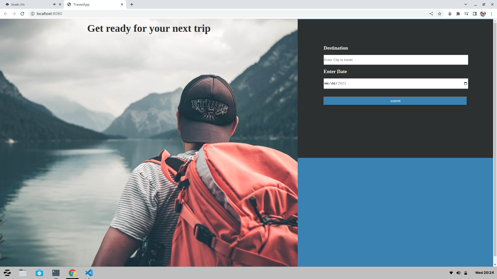
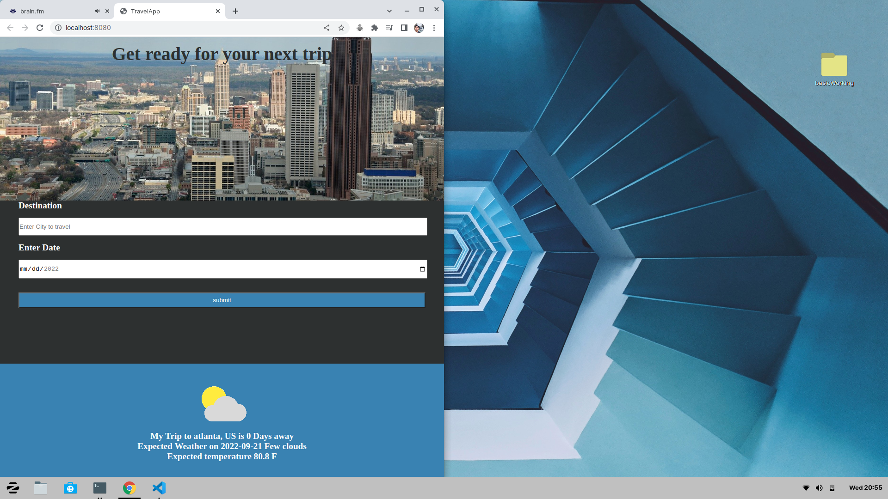

# Project description
### This app takes a date and a city you would like to travel and return the weather information for the date selected with a picure of the city.

1. Full website

2. Mobile version
   

## How to run
in the command line go inside the main folder basicWorking and enter npm run start

### List of Dependencies
Node version used while installing dependencies 16

"dependencies": {
    "cors": "^2.8.5",
    "dotenv": "^16.0.2",
    "express": "^4.18.1",
    "jest-fetch-mock": "^3.0.3",
    "webpack": "^5.74.0",
    "webpack-cli": "^4.10.0"
  },
  "devDependencies": {
    "@babel/core": "^7.18.13",
    "@babel/plugin-transform-modules-commonjs": "^7.18.6",
    "@babel/preset-env": "^7.18.10",
    "babel-loader": "^8.2.5",
    "body-parser": "^1.20.0",
    "clean-webpack-plugin": "^4.0.0",
    "css-loader": "^6.7.1",
    "css-minimizer-webpack-plugin": "^4.1.0",
    "html-webpack-plugin": "^5.5.0",
    "jest": "^29.0.2",
    "mini-css-extract-plugin": "^2.6.1",
    "node-fetch": "^2.6.1",
    "sass": "^1.54.8",
    "sass-loader": "^13.0.2",
    "style-loader": "^3.3.1",
    "terser-webpack-plugin": "^5.3.6",
    "webpack-dev-server": "^4.10.1",
    "workbox-webpack-plugin": "^6.5.4"
  }

  ### Created by Ivan Rebolledo